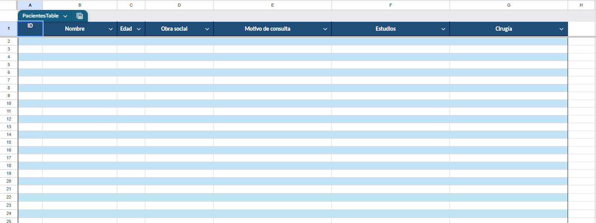

# Pacientes (demo)

A small patient-management web app, originally built for a single doctor to
replace a spreadsheet of patients and their consultation history. **This
repository is a public portfolio demo**, derived from a private production
app: no login, no real backend, and no real patient data — everything you
see is fictional and reset on demand.

Try it: search patients, open one, add/edit a consultation, create a new
patient. Use "Restablecer datos" (top of the patient list) to discard any
changes and restore the original demo dataset.

## Origin story

A friend of mine — a doctor — asked me for something simple: a spreadsheet
to replace the paper log he used to track his patients. Something like
this:



Seven columns — ID, name, age, health insurance, reason for the visit,
studies, surgery notes — is genuinely all he needed to capture. But that
basic version raised the questions that come up as soon as real medical
records are involved: who else can open the file, what happens once a
patient's second or third visit needs its own record instead of overwriting
the last one, and what does "search" even mean past a few hundred rows.

So instead of the spreadsheet, I built the smallest thing that could
replace it properly — a page reachable from any device, searchable, with
real per-patient consultation history, and secured the way medical data
should be (see below). **This repository is the public, sanitized version
of that app** for a portfolio: no login, no real backend, no real patient
data.

## Why this version is different from the real app

The production version of this app is a private, single-user tool that
handles real medical records, so its security is intentionally boring —
boring is what you want for this kind of data:

- **Real authentication, not a shared link.** Supabase Auth,
  email/password, and no sign-up page exists anywhere in the app — the
  one account is created by hand, not through the UI.
- **Row Level Security enforced by the database, not the app.** Every
  query against `patients`/`consultations` is scoped to
  `owner_user_id = auth.uid()` at the Postgres level, so even a bug in the
  frontend can't leak another doctor's patients — the database itself
  refuses the row.
- **Least privilege on top of that.** The `anon` role has its table
  grants revoked entirely: an unauthenticated request isn't just denied by
  a policy, it has no permission to ask in the first place.
- **No privileged credentials ever reach the browser.** Only the Supabase
  *publishable* key is used client-side; the key that could bypass Row
  Level Security is never requested, stored, or referenced anywhere in the
  code.
- **Failed logins don't leak information.** Wrong email or wrong password
  produce the same generic message, so the app never confirms whether a
  given account exists.
- A real Postgres schema (`patients`, `consultations`) with indexes,
  triggers, and search via `pg_trgm`/`unaccent`.

None of that belongs in a public repo, so this demo strips it out:

- No login — the app opens straight to the patient list.
- No backend — `src/app/core/demo-data.store.ts` is a small in-memory /
  `localStorage`-backed store standing in for Supabase, seeded with a
  handful of fictional patients.
- No real credentials, project URLs, or infrastructure of any kind.

Everything else — the Angular architecture, forms, validation, age
calculation, Spanish (Argentina) locale/date formatting — is the same code
that runs in production.

## Stack

- **Angular 22** (standalone components, signals, native `@if`/`@for`),
  strict TypeScript.
- Reactive Forms, typed and non-nullable.
- Vitest for unit tests.
- No runtime dependencies beyond Angular itself (no Supabase client in this
  build).

## Running locally

```bash
npm install
npm start          # http://localhost:4200
npm test
npm run build       # production build → dist/pacientes-pablo-app/browser
```

## Deploying this demo yourself

This repo ships a `wrangler.jsonc` for deploying the static build to
Cloudflare Workers (static assets), under its own Worker name
(`pacientes-demo`) — unrelated to the production deployment:

```bash
npm run build
npm run deploy
```

Any static host works equally well (Netlify, Vercel, GitHub Pages, etc.) —
the output in `dist/pacientes-pablo-app/browser` is a plain static SPA.

## License

MIT — see [LICENSE](./LICENSE).
